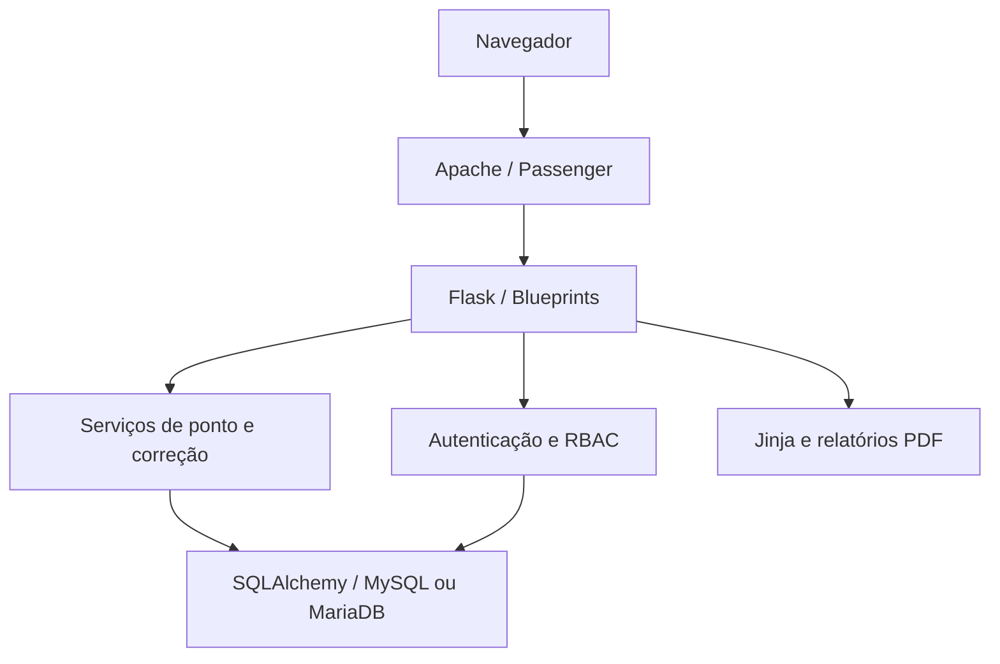
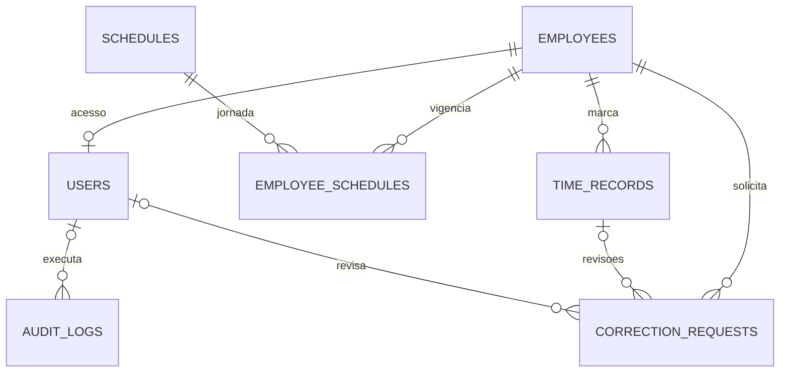

# Arquitetura e dados

## Organização

O navegador solicita páginas renderizadas pelo Flask/Jinja. O Apache/Passenger fornece WSGI ao Application Manager. Os blueprints chamam os serviços de domínio; estes validam regras, usam SQLAlchemy e registram a auditoria na mesma transação das alterações.

Factory em `app/__init__.py`, extensões desacopladas em `extensions.py`, configuração por ambiente e separação por módulos `auth`, `dashboard`, `employees`, `attendance`, `corrections`, `admin`, `audit` e `reports`. Regras em `app/services`; formulários em `app/forms.py`. Não existe serviço frontend ou compilação Node.js.

## Modelo

| Tabela | Propósito / integridade |
|---|---|
| `users` | Usuário único normalizado, hash, role, vínculo único opcional, status, versão de sessão |
| `employees` | Nome, início do controle, status e timestamps; nunca excluído pela aplicação |
| `schedules` | Horários de segunda a sexta e sábado, intervalo e nome único; versões preservadas |
| `employee_schedules` | Funcionário + jornada + vigência inclusiva; cancelamento de agendamentos futuros |
| `time_records` | Tipo, data local, horário original UTC, horário corrigido opcional, IP e origem |
| `correction_requests` | Solicitação/decisão, horário anterior/desejado, motivo, revisor e vínculo à batida |
| `audit_logs` | Operações com usuário, entidade, IP, JSON e timestamp UTC; retenção de três meses |
| `holidays` | Data única e descrição da folga da empresa |
| `system_state` | Registro singleton de instalação; bloqueio transacional para setup e diretoria |
| `login_attempts` | Tentativas inválidas recentes, IP e hash do nome de usuário; expurgo separado |

Há unicidade de funcionário/data/tipo de batida e de funcionário/início de vigência. Chaves estrangeiras preservam relações; CHECKs validam roles, tipos, situações, origens e datas. Índices atendem consultas por funcionário/data, situação de correção e data de auditoria.

## Datas, cálculos e concorrência

Datetimes no banco são UTC sem timezone, com precisão de segundos. `work_date` é a data da batida em America/Sao_Paulo, calculada no servidor; exibição e entrada de correções usam esse fuso. Conversões usam `zoneinfo` e `tzdata` para funcionar também no Windows.

O dia de controle é a mesma data local: turnos noturnos que cruzam a meia-noite não são suportados no MVP. O realizado soma os segmentos ENTRADA→INTERVALO_SAIDA e INTERVALO_RETORNO→SAIDA, ou ENTRADA→SAIDA para jornadas sem intervalo. Segundos são preservados nos cálculos e horários; durações são exibidas em HH:MM, sem arredondamento de tolerância.

Registros incompletos têm saldo pendente; uma sequência inconsistente é identificada e exige correção. No dashboard do dia, um segmento contínuo aberto pode mostrar estimativa até o relógio do servidor. Relatórios usam apenas segmentos fechados.

Em MySQL/MariaDB/InnoDB, serviços de registro, solicitação, aprovação e alteração de jornada bloqueiam a linha do funcionário. A conexão usa isolamento `READ COMMITTED`, e o objeto bloqueado é recarregado: uma leitura de autenticação anterior ao bloqueio não mantém uma visão antiga das marcações depois que outra transação conclui. A aprovação revalida o estado após o bloqueio. Migrations e setup nunca são executados automaticamente por todos os workers. SQLite local não representa os bloqueios de concorrência da produção.

Os relatórios incorporam as fontes DejaVu Sans e Sans Bold, com a licença em `app/static/fonts`. O PDF não depende da substituição de fontes instalada no computador que abre ou imprime o documento.

## Segurança e operação

CSRF em todos os POSTs. Hash scrypt, sem senha padrão. A factory recusa segredo ausente/fraco e configurações de produção com SQLite ou cookies inseguros. Bootstrap local e CSP `self`; nenhum dado sensível vai para CDNs. Login inválido: cinco tentativas por combinação IP/usuário ou trinta por IP em quinze minutos causam bloqueio temporário.

Uma versão de sessão persistida no usuário é comparada em cada requisição. Redefinição/troca de senha e alteração do acesso revogam sessões antigas. Cookies expiram após oito horas conforme a política de sessão do Flask. Cabeçalhos encaminhados por proxy só são aceitos se contagens específicas forem configuradas; o padrão é zero. IP registrado é o observado pelo servidor, não uma garantia da identidade física de quem marca.

`/health` informa apenas status da aplicação e versão; não expõe banco/segredos nem substitui teste de conexão. Operações e correções possuem auditoria; senhas e token de setup não são registrados. Logs técnicos de exceção do Passenger são diferentes da auditoria administrativa e seguem retenção definida na infraestrutura.
